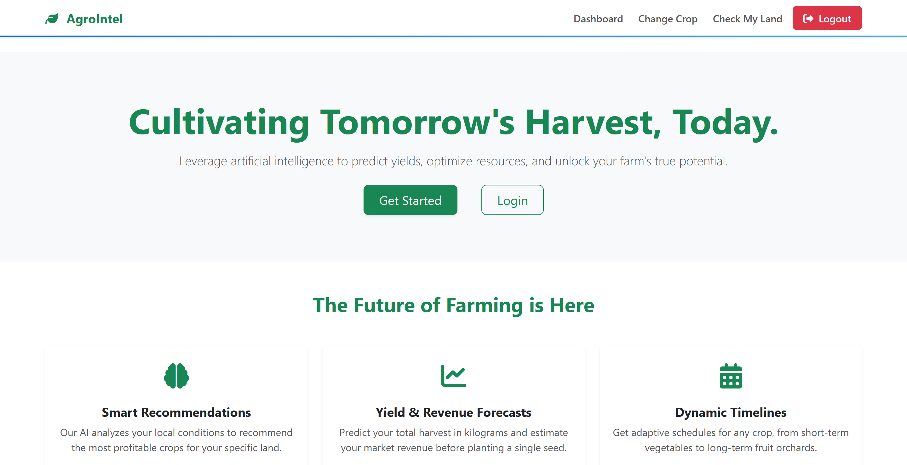
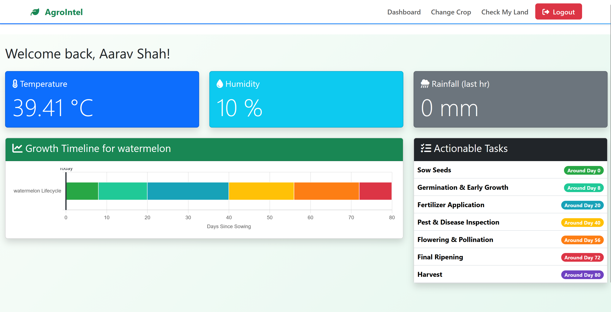

<h1 align="center">🌾 AgroIntel</h1>
<p align="center">
  <em>AI-assisted crop planning and farm intelligence platform with weather-aware recommendations.</em>
</p>

<p align="center">
  
  
  
  
</p>
  <p align="center">
    <a href="https://aaravshah1311.is-great.net">
    
    </a>
  </p>

---

## 🚀 Overview

**AgroIntel** is a full-stack web application designed to help farmers and agri-focused users make better crop decisions using:

- user profile + land details,
- weather insights from OpenWeather,
- crop recommendation logic,
- crop timeline and planning views.

The application uses **Node.js + Express + EJS** on the server side and **MySQL** for persistent storage.

---

## ✨ Core Features

- 🔐 User authentication (signup/login/logout)
- 👤 User profile with land area and location
- 🌦️ Weather-aware dashboard using OpenWeather API
- 🌱 Crop recommendation and selection workflow
- 📅 Crop timeline and harvest-date estimation
- 🧪 Land check page with simulated soil + weather signals

---

## 🖼️ Screenshots

<div align="center">
  
  
</div>

<p align="center">
  <sub><strong>Left:</strong> Dashboard View &nbsp;•&nbsp; <strong>Right:</strong> Crop Recommendation / Selection View</sub>
</p>

---

## 🧱 Project Structure

```text
Agrointel/
├── config/
│   └── db.js
├── controllers/
│   ├── authController.js
│   └── userController.js
├── ml_models/
│   ├── Crop_recommendation.csv
│   └── ml_service.js
├── routes/
│   ├── auth.js
│   └── user.js
├── views/
├── database_schema.sql
├── server.js
└── package.json
```

---

## ⚙️ Installation

### 1) Clone the repository

```bash
git clone https://github.com/aaravshah1311/Agrointel.git
cd Agrointel
```

### 2) Install dependencies

```bash
npm install
```

---

## 🗄️ Database Setup (MySQL)

### 1) Create database and tables

Use the included SQL schema file:

```bash
mysql -u root -p < database_schema.sql
```

This creates:
- `agrointel_db` database
- `users` table
- `user_crops` table

### 2) Verify MySQL is running

Make sure your MySQL server is running and accessible at the host/port you configure in `.env`.

---

## 🔐 Environment Variables (`.env`)

Create a `.env` file in the project root:

```env
DB_HOST=127.0.0.1
DB_USER=YOUR-MYSQL-USERNAME
DB_PASSWORD=YOUR-MYSQL-PASSWORD
DB_NAME=agrointel_db
SESSION_SECRET=RANDOME-SESSION-SECERET-STRING
OPENWEATHER_API_KEY=OPENWEATHER-API-KEY
```

### Notes

- `DB_USER` / `DB_PASSWORD`: your MySQL credentials
- `SESSION_SECRET`: any long random secret string
- `OPENWEATHER_API_KEY`: your API key from OpenWeather

---

## ▶️ Run the Application

### Start in development/local mode

```bash
npm start
```

Server will start at:

```text
http://127.0.0.1:3000
```

---

## 🧪 Common Setup Checklist

- [ ] MySQL server is running
- [ ] Database imported from `database_schema.sql`
- [ ] `.env` file created with valid credentials
- [ ] Dependencies installed with `npm install`
- [ ] OpenWeather API key added

---

## 🛠️ Tech Stack

- **Backend:** Node.js, Express.js
- **Templating:** EJS
- **Database:** MySQL (`mysql2`)
- **Auth/Security:** `bcryptjs`, `express-session`, `connect-flash`
- **External API:** OpenWeather API

---

## 📌 Troubleshooting

- **Database connection errors**
  - Double-check `DB_HOST`, `DB_USER`, `DB_PASSWORD`, `DB_NAME` in `.env`.
- **Weather data shows N/A**
  - Confirm `OPENWEATHER_API_KEY` is valid and active.
- **Session/login issues**
  - Ensure `SESSION_SECRET` is set and restart the server.

---

## 👤 Author

**Aarav Shah**

- GitHub: https://github.com/aaravshah1311/
- Portfolio: https://aaravshah1311.is-great.net

---

<div align="center">
  <sub>Built for smarter crop decisions with practical, weather-aware agricultural intelligence.</sub>
</div>
